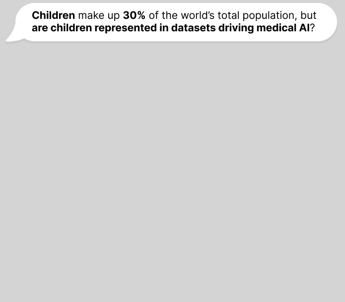

<h1 align="center">Lack of children in public medical imaging data points to growing age bias in biomedical AI</h1>


<p align="center">
  
</p>

<p align="center">
  <a href="[OPT FILL: Path/link to paper]"></a>
  <a href="https://huggingface.co/stan-hua/peds_vs_adult-cxr"></a>
</p>

<p align="center">
  ⚡ In this repository, we provide all data and code artifacts from the analysis.  🚀 ⚡ <br>
</p>


---

## 🌲 About the Repo

<!-- OPTIONAL: Create Repository Structure Automatically
pip install rptree
rptree -d .
[OPT FILL: Copy structure to this README]
-->

```shell
ped_vs_adult-cxr/
├── config/                   # Data directory
│   ├── configspecs/            # Defines model training hyperparameters
│   └── train_model/            # Specified parameters for each model
├── data/                   # Data directory
│   ├── cxr_datasets/               # Contains raw/processed datasets
│   ├── metadata/                   # Contains dataset annotations and CXR metadata
│   └── save_data/              # Saved artifacts from training/inference
│       ├── train_runs/             # Contains training runs (model checkpoints)
│       └── figures/                # Contains all generated figures
├── scripts/                # Contains scripts to run
│  ├── data/                   # Data processing scripts
│  └── model/                  # Model training/evaluation scripts
├── slurm/                  # Contains sbatch scripts for running on SLURM server
└── src/
    └── utils/                  # Contains utility funcitons
        ├── data/                   # for data loading and visualization
        └── model/                  # for model loading
```


## 💴 About the Data

**A. Dataset Review**

> All dataset annotations are provided under [data/metadata/open_data.xlsx](./data/metadata/public_datasets_metadata.xlsx)


**B. Cardiomegaly Case Study**

> Please refer to [data/README.md](./data/README.md) for downloading and preprocessing the chest X-ray datasets used.


---

## 🔧 Installation

**Clone Repository:**
```shell
git clone https://github.com/stan-hua/ped_vs_adults-cxr
cd ped_vs_adults-cxr
```

**Install Packages:**
***(Recommended) Option 1. Pixi***

Pixi is a light-weight package manager, localized to the project's directory.
```shell
# Can replace with torch-gpu for analyses 
# NOTE: A CUDA-compatible GPU is required to install PyTorch GPU packages
pixi shell -e torch-gpu
```

***Option 2. Conda / Pip***
```shell
# a. conda
conda create --name peds_cxr python=3.9.19
conda activate peds_cxr

# b. pip
# pip install -r envs/requirements.txt
```

## 🏃 How to Run

**0. (Optional) Specify package manager in SLURM scripts**
```shell
export USE_PIXI=1     # (1 = use pixi, 0 = uses conda) in SLURM scripts
```

**1. Perform Analysis for Dataset Review**

```shell
# Option 1. Run in current shell
bash slurm/visualize_data.sh

# Option 2. Submit job to SLURM suerver
sbatch slurm/visualize_data.sh
```

**2.0 Train a Model**

> See [slurm/train_model.sh](./slurm/train_model.sh) for more examples

```shell
# To set up CometML for model logging
# Terminal: `pixi add comet-ml` or  `pip install comet-ml`
# Terminal: export COMET_API_KEY="YOUR_API_KEY"

# Option 1. Run in current shell
# NOTE: Config file must be defined under `/config/train_model/`
# NOTE: Replace `dummy` with `vindr_cxr`, `padchest`, `nih_cxr18`, `chexbert`
python -m scripts.train_model -c "exp_cardiomegaly-dummy-mixup-imb_sampler.ini"

# Option 2. Submit job to SLURM server
sbatch slurm/train_model.sh
```


**2.1. Download Pre-Trained Models**
```shell
git clone https://huggingface.co/stan-hua/peds_vs_adult-cxr
# mkdir data/save_data/train_runs         # If directory doesn't exist
mv peds_vs_adult-cxr/* data/save_data/train_runs/
```

**3. Evaluate CXR Models & Generate Figures**

> We **strongly recommend** using the bash script. It performs inference cross-dataset and generates figures from the paper. Additionally, we provide the [raw predictions](https://github.com/stan-hua/ped_vs_adults-cxr/tree/main/data/save_data/inference) and the [figures](https://github.com/stan-hua/ped_vs_adults-cxr/tree/main/data/save_data/figures/eda) for analysis.

> See [slurm/eval_model.sh](./slurm/eval_model.sh) for more details.
```shell
# Option 1. Run in current shell
bash slurm/eval_model.sh

# Option 2. Submit job to SLURM suerver
sbatch slurm/eval_model.sh
```


## 👏 Acknowledgements

**Team**:
1. [Stanley Hua](https://stan-hua.github.io/) @ **The Hospital for Sick Children** (Former), **UC Berkeley** & **UCSF** (Now)
2. [Nicholas Heller](https://scholar.google.com/citations?user=gt3amx8AAAAJ&hl=en) @ **Cleveland Clinic**
3. [Ping He]() @ **The Hospital for Sick Children**
4. [Alexander Towbin](https://www.cincinnatichildrens.org/bio/t/alexander-towbin) @ **Cincinnati Children's Hospital**
5. [Irene Chen](https://irenechen.net/) @ **UC Berkeley** & **UCSF**
6. *[Alex Lu](https://www.alexluresearch.com/) @ **Microsoft Research**
7. *[Lauren Erdman](https://scholar.google.com/citations?user=bSKEpp8AAAAJ&hl=en) @ **Cincinnati Children's Hospital** & **University of Cincinnati**

**Co-senior authors*

For any questions, please email the corresponding author: [Lauren Erdman](mailto:lauren.erdman@cchmc.org).


## Citation

If you find our work useful, please consider citing our paper!

```bibtex
@article{YourName,
  title={Your Title},
  author={Your team},
  journal={Location},
  year={Year}
}
```
